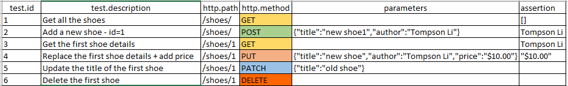
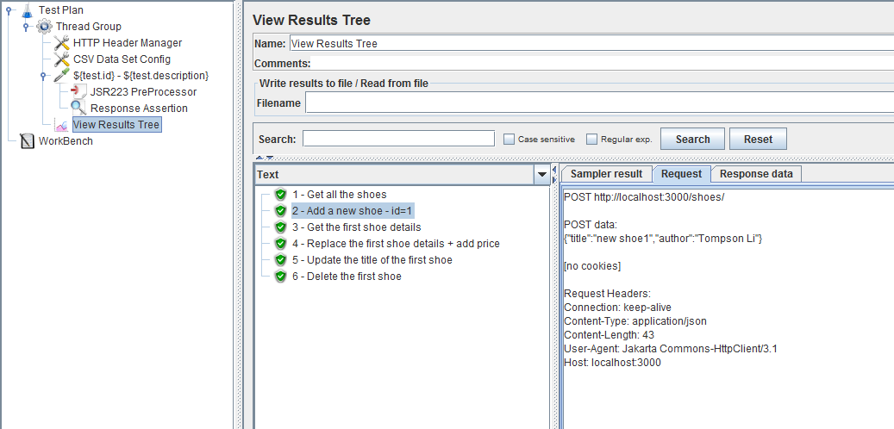

# data-driven-jmeter-rest-api-test
A simple data-driven approach for using jmeter to write api test

# mock server
Using [JSON-Server](https://github.com/typicode/json-server) to get a full fake REST API.You could also use your application APIs if you have.
Once JSON-Server installed, start the server using below command:
<pre><code>json-server --watch db.json</pre></code>

# test secnario in csv

# test script in jmeter

